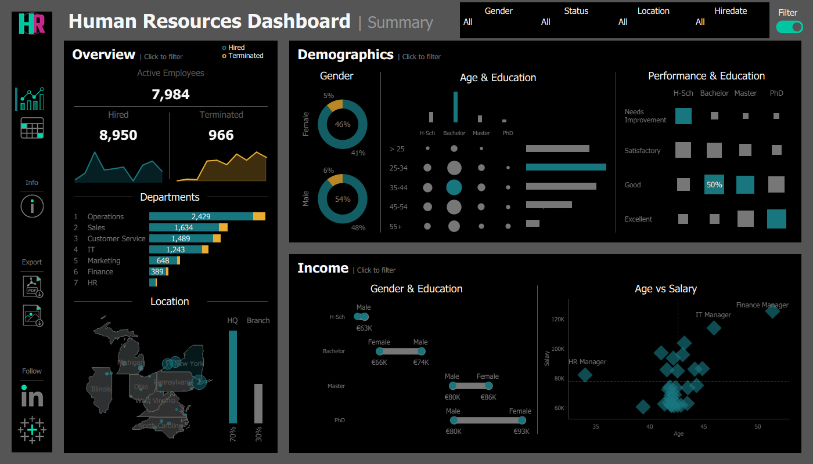
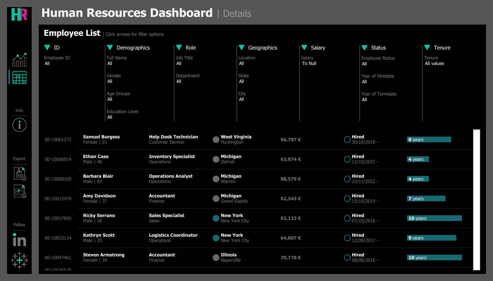
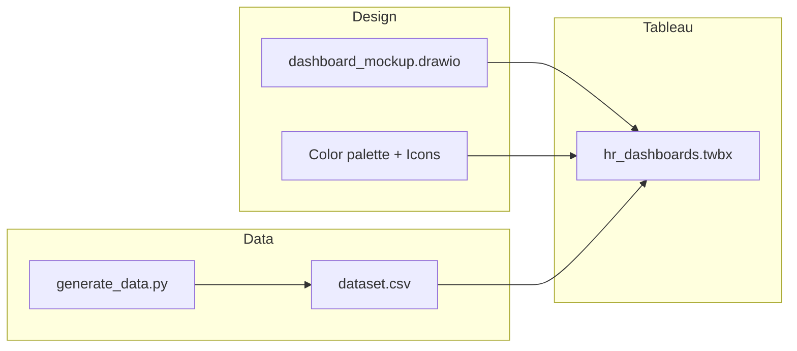

# HR Analytics — Tableau Dashboards & Visualization


> Interactive HR dashboards built in Tableau for workforce analytics—attrition, hiring, headcount, and KPIs—with a Python-generated dataset and planning mockups.

[Overview](#overview) · [Dashboards](#dashboards) · [Project Structure](#project-structure) · [Getting Started](#getting-started) · [Documentation](#documentation)

---

## Overview

### Problem Statement

> HR and leadership need a single, visual view of workforce metrics—attrition, hiring, headcount by department, and trends—without digging into spreadsheets. Static reports don’t support drill-down or self-serve exploration.

### Solution

This project delivers **interactive Tableau dashboards** for HR analytics:

- **Summary dashboard** — High-level KPIs, trends, and at-a-glance metrics
- **Details dashboard** — Record-level exploration, filters, and drill-down
- **Consistent design** — Custom color palette, icons, and layout from planning mockups
- **Reproducible data** — Python script to generate a sample HR dataset for demos and development

The result is a **portfolio-ready** data visualization project that shows end-to-end skills: data preparation, design planning, and Tableau development.

### Key Features

| Feature | Description |
|---------|-------------|
| **Summary view** | Headcount, attrition, hiring KPIs; trend and comparison visuals |
| **Details view** | Record-level data; filters by department, status, tenure |
| **Interactive filters** | Active/inactive filter states; group filters; info panels |
| **Custom assets** | Logo, icons, color palette; consistent branding |
| **Data generation** | Python script for synthetic HR data (reproducible dataset) |
| **Planning docs** | Draw.io mockups for dashboard layout and structure |

### Target Audience

- **Recruiters & hiring managers** — Evidence of data viz, Tableau, and attention to design
- **HR analysts** — Ready-to-use dashboard structure and metrics
- **Data / BI engineers** — Clean repo layout, data + code + assets separation

---

## Dashboards

### Summary Dashboard

High-level HR metrics: headcount, attrition rate, hiring volume, and trends. Designed for executives and managers who need a quick overview.



### Details Dashboard

Drill-down view with filters (department, employment status, etc.) and record-level detail. Supports ad-hoc analysis and validation.



### Design & UX

- **Color palette** — Documented in `assets/colors/project_color_palette.txt`
- **Icons** — Custom filter, download, info, and contact icons in `assets/icons/`
- **Layout** — Planned in `docs/planning/dashboard_mockup.drawio` before build

---

## Architecture & Data Flow



| Stage | Artifact | Purpose |
|-------|----------|---------|
| **Data** | `src/generate_data.py` | Generate synthetic HR data |
| **Data** | `data/raw/dataset.csv` | Input for Tableau |
| **Planning** | `docs/planning/dashboard_mockup.drawio` | Layout and structure |
| **Assets** | `assets/colors/`, `assets/icons/` | Branding and UI elements |
| **Deliverable** | `assets/dashboards/hr_dashboards.twbx` | Tableau workbook |

---

## Tech Stack

| Component | Technology |
|-----------|------------|
| **Visualization** | Tableau Desktop |
| **Data generation** | Python (pandas, etc.) |
| **Planning** | Draw.io |
| **Data format** | CSV |

### System Requirements

- **Tableau Desktop** (or Tableau Reader for view-only)
- **Python** 3.8+ (for data generation)
- **Draw.io** (optional; for editing mockups)

---

## Project Structure

```
hr-analytics-visualization-tableau/
├── data/
│   └── raw/
│       └── dataset.csv              # HR dataset (source for Tableau)
├── src/
│   └── generate_data.py             # Script to generate dataset
├── docs/
│   └── planning/
│       └── dashboard_mockup.drawio # Dashboard layout mockup
├── assets/
│   ├── dashboards/
│   │   └── hr_dashboards.twbx       # Tableau workbook
│   ├── images/                      # Dashboard previews
│   │   ├── hr_summary_dashboard.png
│   │   └── hr_details_dashboard.png
│   ├── colors/
│   │   └── project_color_palette.txt
│   └── icons/                       # Custom icons (filters, download, etc.)
├── README.md
└── .gitignore
```

### Folder Descriptions

| Folder | Purpose |
|--------|---------|
| `data/raw/` | Source dataset for Tableau |
| `src/` | Python script for data generation |
| `docs/planning/` | Design and layout mockups |
| `assets/dashboards/` | Tableau workbook (.twbx) |
| `assets/images/` | Dashboard screenshots for README/docs |
| `assets/colors/` | Color palette and design tokens |
| `assets/icons/` | Icons used in dashboards |

---

## Getting Started

### Prerequisites

- Tableau Desktop (or Tableau Reader)
- Python 3.8+ (optional; only for regenerating data)

### Option 1 — Use Existing Data & Workbook

1. **Clone the repo**
   ```bash
   git clone https://github.com/Konstant-gk/hr-analytics-visualization-tableau.git
   cd hr-analytics-visualization-tableau
   ```

2. **Open the workbook**
   - Open `assets/dashboards/hr_dashboards.twbx` in Tableau.
   - If Tableau prompts for the data source, point it to `data/raw/dataset.csv` (relative to the repo root or use an absolute path).

3. **Refresh data** (optional)
   - In Tableau: Data → [your data source] → Refresh.

### Option 2 — Regenerate Data Then Open Workbook

1. **Clone the repo** (as above).

2. **Run the data generation script**
   ```bash
   python -m venv .venv
   .venv\Scripts\activate   # Windows
   # source .venv/bin/activate  # Linux/macOS
   pip install pandas       # add any other deps from the script
   python src/generate_data.py
   ```
   Ensure the script outputs `dataset.csv` to `data/raw/` (or update the script’s output path to match).

3. **Open** `assets/dashboards/hr_dashboards.twbx` in Tableau and connect to `data/raw/dataset.csv`.

### Verifying the Dashboards

- **Summary:** Open the summary sheet/dashboard; check KPIs and trends.
- **Details:** Open the details sheet/dashboard; use filters and verify record-level data.

---

## Usage

### Viewing the Dashboards

- **Tableau Desktop:** Open `assets/dashboards/hr_dashboards.twbx`; navigate between sheets/dashboards.
- **Tableau Reader:** Same file; view and interact without editing.

### Regenerating the Dataset

Run the Python script when you need a fresh or modified dataset:

```bash
python src/generate_data.py
```

Then in Tableau, refresh the data source to use the new `data/raw/dataset.csv`.

### Editing the Design

- **Mockups:** Edit `docs/planning/dashboard_mockup.drawio` in Draw.io.
- **Colors:** Update `assets/colors/project_color_palette.txt` and apply in Tableau.
- **Icons:** Replace or add files in `assets/icons/` and update the workbook as needed.

---

## Documentation

| Resource | Description |
|----------|-------------|
| [docs/planning/](docs/planning/) | Dashboard layout mockup (Draw.io) |
| [assets/images/](assets/images/) | Dashboard preview images |
| [assets/colors/](assets/colors/) | Project color palette |

---

## What This Project Demonstrates

| Competency | How It’s Shown |
|------------|----------------|
| **Data visualization** | Two Tableau dashboards (summary + details) with clear KPIs |
| **Dashboard design** | Planning mockup, color palette, custom icons |
| **Data preparation** | Python script for reproducible HR dataset |
| **Repo organization** | Standard layout: `data/`, `src/`, `docs/`, `assets/` |
| **Documentation** | README with overview, structure, and run instructions |

---

## Contributing

1. Fork the repository.
2. Create a branch (`feat/`, `fix/`, `docs/`).
3. Open a Pull Request.

---

## License

MIT — see [LICENSE](LICENSE) if present.

---

## Acknowledgements

Dataset and presentation in Tableau was inspired by data with baraa' project on youtube.
https://www.youtube.com/@DataWithBaraa

---

## Contact

- **Repository:** [Konstant-gk/hr-analytics-visualization-tableau](https://github.com/Konstant-gk/hr-analytics-visualization-tableau)
- **Issues:** [GitHub Issues](https://github.com/Konstant-gk/hr-analytics-visualization-tableau/issues)
